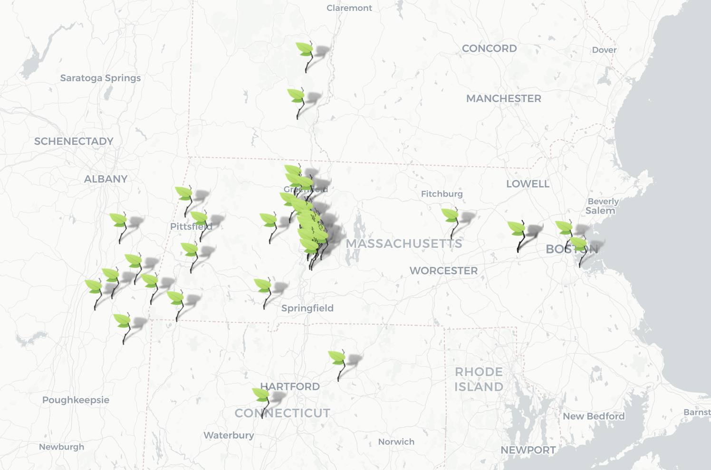

```{r setup, include=FALSE}
knitr::opts_chunk$set(echo = FALSE)
library(tidyverse)
library(readxl)
theme_set(theme_classic())
library(showtext)
font_add_google("Roboto", "Roboto")
showtext_auto()
```

<!-- data read in --> 

```{r}
df <- read_xlsx("food_data.xlsx") |> 
  rename(spend = total_spend, local = local_category)

df[is.na(df)] <- "NA"

total_spend <- sum(df$spend)
```


Data for this report were compiled by the MaetaData group for the 2020-2021 fiscal year, which ran from October 1, 2020 to September 30, 2021. Records include all purchases made to external vendors by Valentine Dining Hall. Of note, purchases made to the Book and Plow Farm were not considered purchases to external vendors and were thus not included in this analysis. 


```{r, fig.width = 5.5, fig.height = 5}
df_loc <- df |> 
  group_by(local) %>% 
  summarize(spend_total = sum(spend), 
            spend_prop = sum(spend)/total_spend) %>% 
  mutate(perc_label = ifelse(spend_prop > 0.02, 
                             paste0(as.character(round(spend_prop, 2)*100), "%"), 
                             "")) %>% 
  mutate(full_label = paste0(local, " (", perc_label, ")")) %>% 
  mutate(x_val = "Spend") %>% 
  mutate(local = fct_reorder(local, spend_prop)) |> 
  arrange(desc(local), desc(spend_prop)) |> 
  mutate(text_y = cumsum(spend_prop) - spend_prop/2)

# #stacked bar
# df_loc %>% 
#   ggplot(aes(x = x_val, y = spend_prop, fill = local)) +
#   geom_bar(position = "fill", stat = "identity") +
#   geom_text(aes(label = perc_label), position = position_fill(vjust = 0.5)) +
#   scale_fill_manual(values = c("#9BBFE0", "#E8A09A", "#FBE29F", "grey65")) +
#   theme(axis.text.x=element_blank(),
#         axis.ticks.x=element_blank() ) +
#   labs(y = "Proportion of spend", x = NULL, title = "Local Expenditure", 
#        fill = "Category")

```

```{r, fig.width = 6, fig.height = 3.5}
#pi-chart
ggplot(df_loc, aes(x="", y=spend_prop, fill=local)) +
  geom_bar(stat="identity", width=0.75) +
  scale_fill_manual(values = c("#9BBFE0", "#E8A09A", "#FBE29F", "grey75")) +
  labs(title = "Local Expenditure", 
       fill = "Category") +
  ggrepel::geom_label_repel(aes(label = perc_label, y = text_y), fill = "white",
                   nudge_x = 0.6) + #, position = position_fill(vjust = 1)
  coord_polar("y", start=0) +
  theme_void() + # remove background, grid, numeric labels +
  theme(text=element_text(family="Roboto"))
```

This figure includes the breakdown of local products as a proportion of total spend. In this graph, local is defined as within 250 miles of Amherst College. Local products are categorized as locally sourced and distributed (local vendors/local products), locally distributed but *not* locally sourced (local business/non-local products), or distributed by a local distribution center owned by a national corporation (Local DC of Natl. Co.). 

```{r, fig.width = 5, fig.height = 5}
categ <- c("Minimal Processed", "Simple Processed", "Culinary Ingredients", "Plant Protein", 
           "Animal Protein", "Highly Processed", "Beverages (ND)", "Dairy")
df_pb <- df %>% 
  group_by(category) %>% 
  summarize(spend_total = sum(spend), 
            spend_prop = sum(spend)/total_spend) %>% 
  ungroup() |> 
  mutate(perc_label = ifelse(spend_prop > 0.02, 
                             paste0(as.character(round(spend_prop, 2)*100), "%"), 
                             "")) %>% 
  mutate(full_label = paste0(category, " (", perc_label, ")")) %>% 
  mutate(x_val = "Spend") %>% 
  mutate(category = factor(category, levels = categ)) |> 
  arrange(desc(category)) |> 
  mutate(text_y = cumsum(spend_prop) - spend_prop/2) 
# 
# #stacked bar
# df_pb %>% 
#   ggplot(aes(x = x_val, y = spend_prop, fill = category)) +
#   geom_bar(position = "fill", stat = "identity") +
#   geom_text(aes(label = perc_label), position = position_fill(vjust = 0.5)) +
#   # scale_fill_brewer(palette = "PiYG", direction = -1) +
#   scale_fill_manual(values = c("#5BC8B2", "#7ED9CA", "#8ee6d7", "#b2f7ea", 
#                                "#f6b092", "#f6c492", "#f6cf92", "#f6d992")) +
#   theme(axis.text.x=element_blank(),
#         axis.ticks.x=element_blank() ) +
#   labs(y = "Proportion of spend", x = NULL, title = "Plant-Based Expenditure", 
#        fill = "Category")
```

```{r, fig.width = 6, fig.height = 3.5}
#plant-based pie chart
ggplot(df_pb, aes(x="", y=spend_prop, fill=category)) +
  geom_bar(stat="identity", width=0.75) +
  scale_fill_manual(values = c("#5BC8B2", "#7ED9CA", "#8ee6d7", "#b2f7ea", 
                               "#f6b092", "#f6c492", "#f6cf92", "#f6d992")) +
  labs(title = "Plant-Based Expenditure", 
       fill = "Category") +
  ggrepel::geom_label_repel(aes(label = perc_label, y = text_y), fill = "white",
                   nudge_x = 0.5) + #, position = position_fill(vjust = 1)
  coord_polar("y", start=0) +
  theme_void() +# remove background, grid, numeric labels
  theme(text=element_text(family="Roboto"))
```

This figure includes the breakdown of different plant-based related categories as a proportion of total spend. Categories in this graph that are considered plant-based include Minimal Processed, Simple Processed, and Culinary Ingredients. Plant Protein, which we define as processed, plant-based alternatives to meat, eggs, or dairy, is grouped with the plant-based categories. 

{#id .class width=65% height=65%}

This map includes the locations of all local vendors from which Valentine purchased products. 
